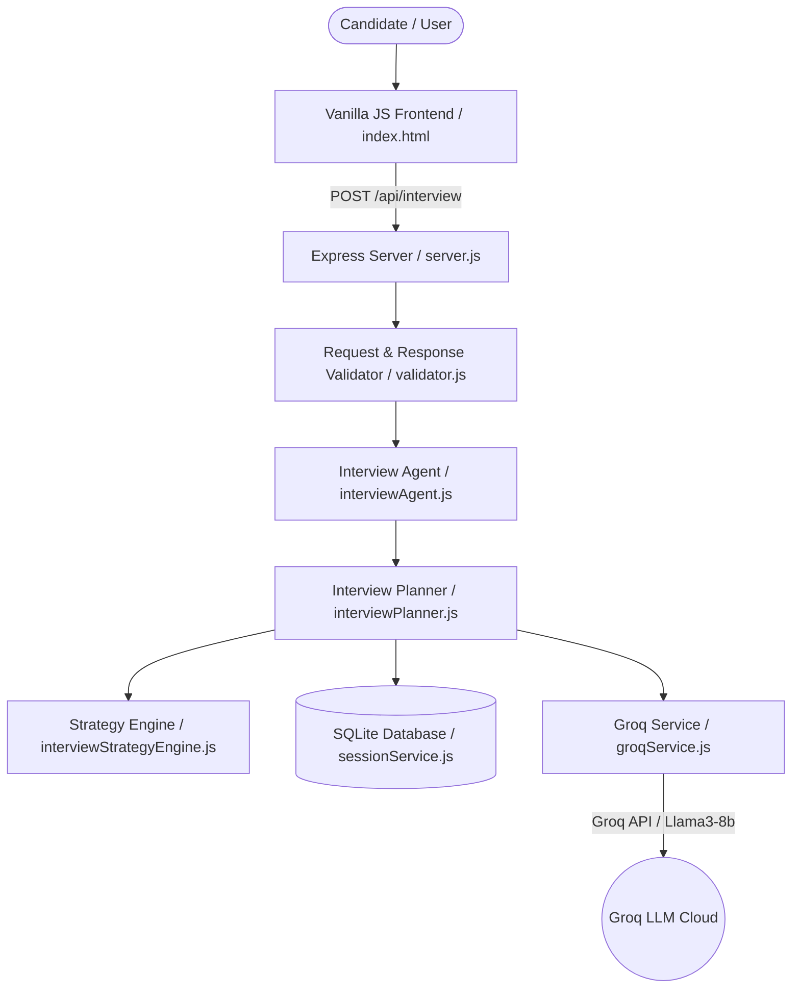

# SentinelAI • Premium AI Technical Interviewer

> **Adaptive, Candidate-Aware AI Technical Interviewer built with Deterministic Strategy Control, Groq LLM Intelligence, and Evidence-Based Evaluation.**

[](#testing)
[](#architecture)
[](#architecture)
[-emerald)](#architecture)

---

## 🎯 Problem

Traditional technical interviews and static screening tools suffer from critical limitations:
1. **Static, Unadaptive Questions**: Standard screeners ask rigid questions that ignore a candidate's background, past answers, and demonstrated depth.
2. **LLM Hallucination & Unbounded State**: Pure LLM chatbots lose track of question counts, repeat topics endlessly, fabricate candidate achievements, or allow prompt injection to bypass evaluation rules.
3. **Template-Driven Vague Feedback**: Typical interview tools produce generic advice like *"Demonstrated strong technical depth"* rather than evidence-grounded evaluation.

---

## 🚀 Solution

**SentinelAI** bridges candidate intelligence with deterministic strategy control and Groq LLM natural language phrasing:
- **Personalized Candidate Intelligence**: Analyzes candidate background, experience level, and curriculum progress to derive custom topic priorities and initial difficulty.
- **Deterministic Interview Strategy Engine**: Enforces strict completion invariants (**minimum 8 questions AND minimum 4 unique curriculum days**), follow-up budget limits (**max 2 per topic**), and adaptive difficulty transitions (`FOUNDATION` ↔ `APPLICATION` ↔ `DEPTH` ↔ `ADVANCED` ↔ `ARCHITECTURE`).
- **Groq LLM Intelligence Layer**: Generates natural technical interviewer questions, evaluates candidate answers across 4 dimensions (0–5 bounded scores), and synthesizes evidence-grounded debrief reports.
- **Zero-Downtime Fallback Security**: If Groq API rate limits (HTTP 429) or timeouts occur, deterministic fallback evaluators maintain 100% API contract uptime.

---

## 🧠 Why SentinelAI?

SentinelAI is not simply an AI chatbot wrapper. It is an **orchestrated adaptive technical interviewer**:

1. **Asks**: Selects curriculum topics dynamically based on candidate role and historical signals.
2. **Evaluates**: Scores answers on technical accuracy, depth, practical reasoning, and communication.
3. **Identifies Depth**: Detects whether the candidate understands core concepts, edge cases, or architecture trade-offs.
4. **Probes Weaknesses**: Asks clarifying follow-ups when answers are vague or incomplete.
5. **Increases Difficulty**: Escalates to deep dives and production trade-offs when answers are strong.
6. **Transitions Intelligently**: Rotates topics when follow-up budgets are reached to ensure broad competency coverage.
7. **Produces Evidence-Based Reports**: Synthesizes final reports with specific evidence bullets formatted as `[Competency]: [specific evidence demonstrated]`.

---

## ✨ Key Features

- 🧠 **Candidate-Aware Personalization**: Adapts initial question difficulty and topic priorities to individual candidate background signals.
- 🎯 **Adaptive Follow-Up & Topic Transitions**: Probes depth when answers are strong, reframes concepts when answers are weak, and transitions topics when the 2-followup budget is exhausted.
- 🛡️ **Deterministic Guardrails**: 100% immune to prompt injections ("ignore previous instructions", "finish interview now"); LLM never controls state or completion logic.
- 📊 **Structured Debrief Report**: Synthesizes executive summary, demonstrated strengths (`[Competency]: [Evidence]`), technical gaps (`[Area]: [Gap]`), and 3 actionable next steps.
- 🎨 **Virtual Technical Interview Room UI**: Dark glassmorphism UI featuring an animated Neural AI Interviewer Orb, expandable history drawer, interview map, and auto-resizing response editor.
- 🔒 **Enterprise Security & Isolation**: Parameterized SQLite state storage, session isolation across concurrent sessions, zero secrets in client bundles or logs.

---

## 🏗️ Architecture



---

## 🎬 Demo Flow

1. **Select Candidate Profile**: Choose a candidate profile to load background context and curriculum signals.
2. **Start Technical Interview**: Launch session and receive candidate-personalized Question 1.
3. **Answer Technical Question**: Submit a technical response covering architecture and implementation details.
4. **Receive Adaptive Follow-Up**: Experience adaptive probing (deep dive on strong answers, clarification on weak answers).
5. **Explore Technical Domains**: Progress across multiple curriculum competencies tracked on the Interview Map.
6. **Review Conversation History**: Inspect previous turns, questions, answers, and topic tags in the history drawer.
7. **Complete Interview**: Reach completion criteria (8+ questions, 4+ curriculum competencies).
8. **Generate Assessment Debrief**: View evidence-grounded debrief report with strengths, areas to strengthen, and next steps.

---

## 🌐 Environment Variables

SentinelAI requires only server-side environment configuration. **No secrets are exposed to the client.**

| Variable Name | Description | Default / Format |
|---|---|---|
| `GROQ_API_KEY` | Server-side API key for Groq Cloud LLM | `gsk_...` |
| `PORT` | Web server port | `3000` |
| `NODE_ENV` | Runtime environment | `production` or `development` |

---

## 🛠️ Local Development

### Prerequisites
- Node.js (v18+)
- npm

### 1. Install Dependencies
```bash
npm install
```

### 2. Environment Setup
Create a `.env` file in the root directory:
```bash
GROQ_API_KEY=your_groq_api_key_here
PORT=3000
```

### 3. Start Server
```bash
npm start
```
Open `http://localhost:3000` in your browser.

---

## 🧪 Testing

SentinelAI includes a comprehensive regression test suite covering strategy decisions, LLM fallbacks, API validation, deduplication, and end-to-end synthetic interview flows.

```bash
# Run complete workspace test suite (18 test files)
node testRunner.js
node verifySqlitePersistence.js
node testPhase6.js
node testPhase7.js
node testPhase8.js
node testPhase9.js
node testPhase10.js
node testPhase11UI.js
node testPhase12Integration.js
node testPhase13QA.js
node testPhase14Hardening.js
node testPhase15TopicTransition.js
node testPhase16InitialTopicAlignment.js
node testPhase17DebriefNormalization.js
node testPhase18EvidenceDebrief.js
node testPhase19Hardening.js
node testPhase20Polish.js
node verifyE2E.js
```

**Current Test Status**: **406 / 406 Assertions PASSED (100% Pass Rate)**

---

## 🚀 Deployment

SentinelAI is configured for zero-downtime deployment on Render Web Services:
- **Build Command**: `npm install && npm rebuild sqlite3 --build-from-source`
- **Start Command**: `npm start`
- **Health Check Endpoint**: `/health`
