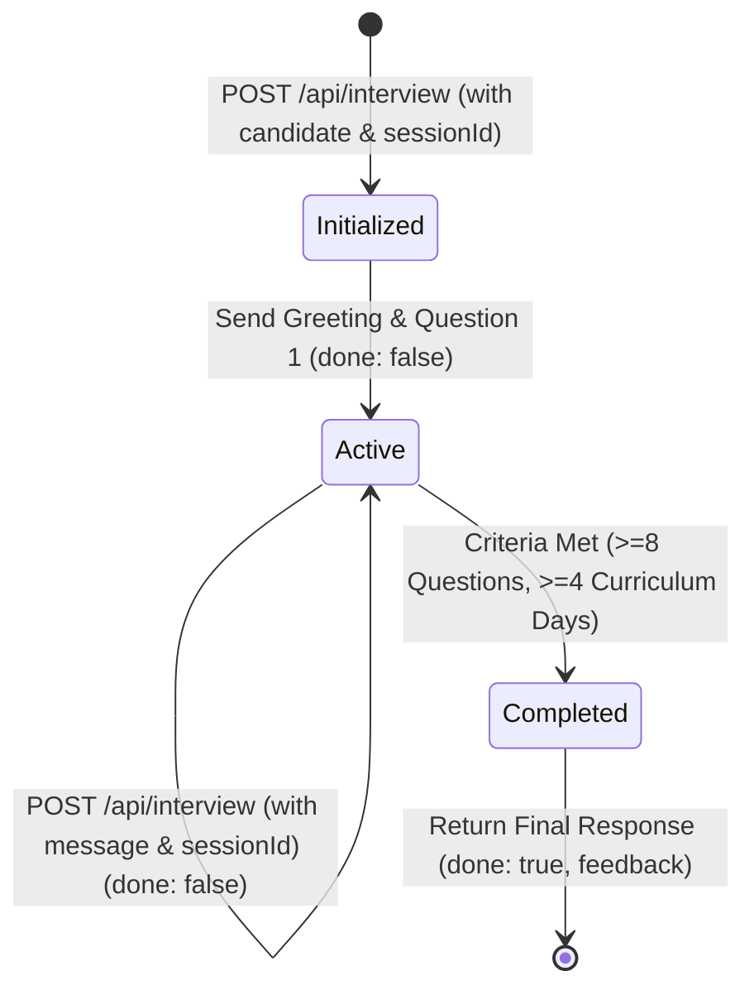

# Requirements Specification: AI Interview Agent

Authoritative Sources:
- `technical-spec.md`
- `candidates.json`
- `curriculum.json`

---

## 1. Problem Statement
The objective is to build an autonomous AI Interview Agent service exposed via `POST /api/interview`. The agent conducts an interactive, multi-turn technical interview of candidates who participated in an intensive 31-day AI Cohort curriculum (`curriculum.json`). Using candidate metadata and cohort performance signals (`candidates.json`), the agent personalizes questions, adaptively probes knowledge across curriculum topics, and generates a structured evaluation report upon completion (`technical-spec.md`).

---

## 2. Functional Requirements
- **FR-1 [Organizer Spec]**: Expose a single HTTP POST endpoint: `/api/interview`.
- **FR-2 [Organizer Spec]**: Require no authentication for requests to `/api/interview`.
- **FR-3 [Organizer Spec]**: Maintain conversation state across requests using the provided `sessionId`.
- **FR-4 [Organizer Spec]**: Handle the initial turn when a `candidate` object is provided alongside `sessionId`.
- **FR-5 [Organizer Spec]**: Handle ongoing turns when a candidate `message` is provided alongside `sessionId`.
- **FR-6 [Organizer Spec]**: Return `"done": false` during active interview turns.
- **FR-7 [Organizer Spec]**: Return `"done": true` on the final interview turn along with a structured `feedback` object.
- **FR-8 [Organizer Spec]**: Output feedback containing four mandatory fields: `summary` (string), `strengths` (string[]), `gaps` (string[]), and `next` (string[]).

---

## 3. Non-Functional Requirements
- **NFR-1 [Implementation Decision]**: Low response latency (< 2 seconds per turn).
- **NFR-2 [Implementation Decision]**: Session isolation (concurrent sessions with different `sessionId` values must remain strictly isolated).
- **NFR-3 [Implementation Decision]**: High availability and zero-crash fault tolerance (graceful fallbacks if external LLM providers experience timeouts or rate limits).

---

## 4. Exact API Contract (`POST /api/interview`)

### A. Start Interview (Turn 0)
- **Request Body**:
  ```json
  {
    "sessionId": "string",
    "candidate": {
      "member": {
        "id": "string",
        "name": "string",
        "jobRole": "string",
        "yearsExperience": 0,
        "education": "string",
        "status": "string"
      },
      "missions": [
        { "day": 0, "title": "string", "passed": true, "attempts": 1, "skipped": false }
      ],
      "signals": { "commitDays": 0, "missionsCompleted": 0, "missionsFirstTry": 0 }
    }
  }
  ```
- **Response Body**:
  ```json
  {
    "reply": "string",
    "done": false
  }
  ```

### B. Conversation Turn Request
- **Request Body**:
  ```json
  {
    "sessionId": "string",
    "message": "string"
  }
  ```
- **Response Body**:
  ```json
  {
    "reply": "string",
    "done": false
  }
  ```

### C. End Interview Response (Final Turn)
- **Response Body**:
  ```json
  {
    "reply": "string",
    "done": true,
    "feedback": {
      "summary": "string",
      "strengths": ["string"],
      "gaps": ["string"],
      "next": ["string"]
    }
  }
  ```

---

## 5. Interview Lifecycle



---

## 6. Session/State Model
- **Lookup Key**: `sessionId` (string)
- **Attributes**:
  - `sessionId`: string
  - `candidate`: CandidateProfile
  - `turnCount`: number
  - `questionCount`: number
  - `coveredDays`: Set<number>
  - `history`: Array<{ role: 'agent'|'candidate', content: string }>
  - `status`: `'ACTIVE' | 'COMPLETED'`
  - `evaluations`: { strengths: string[], gaps: string[], next: string[] }

---

## 7. Candidate Personalization Rules
- **Rule 1 [Organizer Spec]**: Use candidate `member` info (`jobRole`, `yearsExperience`, `education`) to tailor difficulty and background context.
- **Rule 2 [Organizer Spec]**: Use candidate `missions` history (`passed`, `skipped`, `attempts`) to choose targeted deep-dive vs gap-probing topics.
- **Rule 3 [Organizer Spec]**: Incorporate candidate `signals` (`commitDays`, `missionsCompleted`, `missionsFirstTry`) to evaluate engineering discipline.

---

## 8. Curriculum Coverage Rules
- **Rule 1 [Implementation Decision]**: Cover a minimum of 4 distinct curriculum days from `curriculum.json`.
- **Target Curriculum Day Clusters**:
  - **Cluster 1**: Day 7 / Day 10 (Embeddings & Vector Databases / ChromaDB)
  - **Cluster 2**: Day 13 (Function Calling & Pydantic Validation)
  - **Cluster 3**: Day 22 / Day 23 (Multi-Agent Orchestration & Model Context Protocol)
  - **Cluster 4**: Day 28 / Day 29 (Docker/K8s Deployment & Observability)

---

## 9. Adaptive Questioning Rules
- **Rule 1 [Implementation Decision]**: Minimum 8 technical questions asked before completion.
- **Rule 2 [Organizer Spec & Implementation Decision]**: If candidate response is brief or lacks detail, generate an adaptive clarifying follow-up.
- **Rule 3 [Implementation Decision]**: If candidate admits ignorance on a topic, record a gap and adaptively transition to an adjacent curriculum day.

---

## 10. Final Feedback Schema (`technical-spec.md`)

| Field | Exact Type | Description |
| :--- | :--- | :--- |
| `summary` | `string` | Executive evaluation of candidate depth, background, and cohort performance. |
| `strengths` | `string[]` | Concise, actionable array of technical strengths. |
| `gaps` | `string[]` | Concise, actionable array of identified knowledge gaps / skipped modules. |
| `next` | `string[]` | Concise, actionable array of recommended next learning/career steps. |

---

## 11. Error and Edge Cases
- **EC-1 [Implementation Decision]**: Missing `sessionId` $\rightarrow$ HTTP 400 (`{ "error": "sessionId is required" }`).
- **EC-2 [Implementation Decision]**: Missing both `candidate` and `message` $\rightarrow$ HTTP 400 (`{ "error": "Either candidate or message must be provided" }`).
- **EC-3 [Implementation Decision]**: Message on non-existent `sessionId` $\rightarrow$ Auto-initialize baseline session or return HTTP 400.
- **EC-4 [Implementation Decision]**: LLM provider timeout $\rightarrow$ Graceful fallback generator preserving contract types.

---

## 12. Acceptance Criteria
1. `POST /api/interview` conforms 100% to contract schemas.
2. Minimum 8 questions asked across minimum 4 curriculum days.
3. Personalization reflects candidate profile and mission track record.
4. Final response returns `done: true` with a valid `feedback` object (`summary`, `strengths`, `gaps`, `next`).
5. Sessions remain strictly isolated per `sessionId`.

---

## 13. Technical Constraints
- **TC-1 [Organizer Spec]**: Exposed endpoint MUST be `POST /api/interview`.
- **TC-2 [Organizer Spec]**: Candidate objects will adhere to `candidate.json` / `candidates.json` schema.
- **TC-3 [Organizer Spec]**: Free choice of framework, backend, LLM, or architecture.

---

## 14. Hackathon Judging Considerations
- **Risk 1**: Schema mismatch (`summary` as array or missing `next` field).
- **Risk 2**: Session state leakage between concurrent test runs.
- **Risk 3**: LLM API key rate limits or network drops breaking automated grading scripts.
- **Risk 4**: Prematurely completing the interview before reaching minimum question depth.
